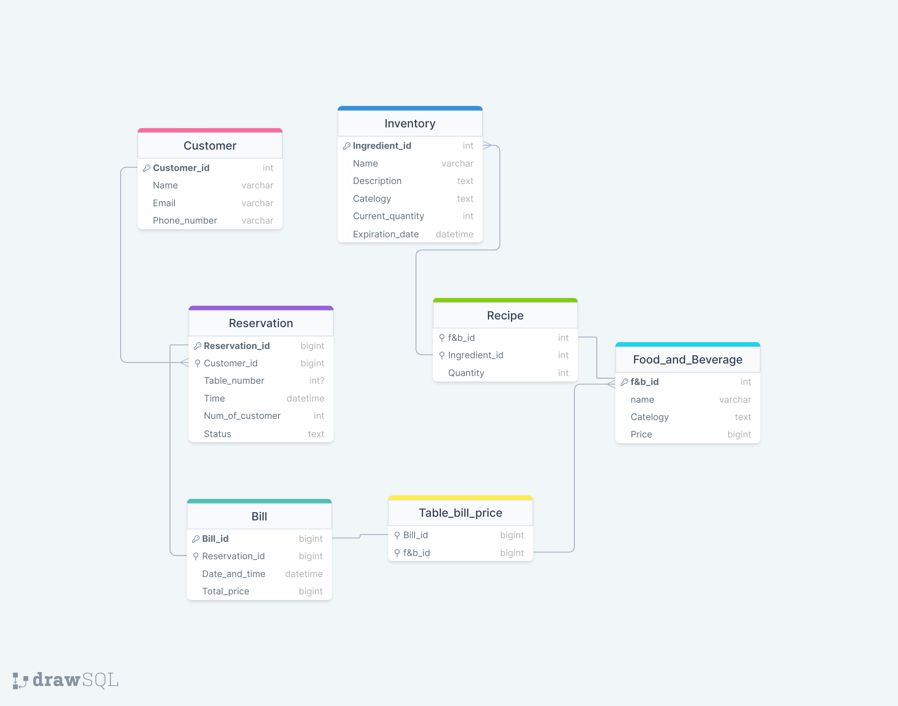

<div align="center">
  <h1>THIẾT KẾ MÔ HÌNH CƠ SỞ DỮ LIỆU QUẢN LÝ NHÀ HÀNG
  </h1>
  <p>
    <strong>Bộ môn Cơ sở dữ liệu - Mã lớp 147773</strong>
  </p>
</div>

<!-- Chen anh vao day -->

<details>
  <summary><b>Mục lục</b></summary> 
  
   <ol>
      <li><a href="#gioi-thieu-de-tai">Giới thiệu để tài</a></li>
      <li><a href="#danh-sach-thanh-vien">Danh sách thành viên</a></li>
      <li><a href="#xay-dung-mo-hinh-du-lieu">Xây dựng mô hình dữ liệu</a></li>
      <li><a href="#danh-sach-cau-truy-van-sql-va-bieu-thuc-dsqh">Danh sách các câu truy vấn SQL và biểu thức ĐSQH</a></li>
      <li><a href="#danh-sach-phu-thuoc-ham">Danh sách các phụ thuộc hàm</a></li>
   </ol>

</details>

<h1 id="gioi-thieu-de-tai">1. Giới thiệu để tài</h1>

Xuất phát từ nhu cầu chuyển đổi số, hệ thống mô hình dữ liệu quản lý nhà hàng
được xây dựng nhằm mục đích ứng dụng công nghệ vào trong hoạt động lưu
trữ và xử lý thông tin một cách hiệu quả, hợp lý và nhanh chóng theo những
nhu cầu cụ thể :
<ol type = 'i'>
  <li> Về phía người quản lý nhà hàng: tăng cường khả năng quản lý và thống
kê, giup người chủ có thể giám sát nguồn nhân sự, cơ sở vật chất tài chính,
chất lượng dịch vụ qua đó nhằm tối ưu hóa hiệu suất kinh doanh </li>
  <li> Về phía nhân sự trong nhà hàng: giúp nhân viên quản lý lịch làm việc,
quản lý thực phẩm, thực đơn và thông tin cũng như yêu cầu từ phía khách
hàng,... </li>
  <li>Về phía khách hàng: Tạo ra trải nghiệm tương tác với khách hàng thông
qua việc lưu trữ thông tin mua hang, hóa đơn điện tử và nhiều dịch vụ
trực tuyến khác. </li>
</ol>


<h2 id="danh-sach-thanh-vien">2. Danh sách thành viên</h2>

| STT | Họ tên | MSSV | 
| :-------- | :------- | :----------|
| 1 | Hồ Tuấn Anh | 20226100 |
| 2 | Phạm Trường Dương | 20226105 |
| 3 | Nguyễn Trung Hiếu | 20226082 |
| 4 | Nguễn Huy Hoàng | 20226107 |
| 5 | Đỗ Gia Huy | 20226085 |

<h2 id="xay-dung-mo-hinh-du-lieu">3. Xây dựng mô hình dữ liệu</h2>

## 3.1. Mô hình thực thể - liên kết

Danh sách thực thể:
<ul>
  <li> Customer: Thông tin của khách hàng </li>
  <li> Employee: Thông tin của nhân viên nhà hàng </li>
  <li> Inventory: Thông tin của tất cả các nguyên liệu trong kho </li>
  <li> F&B: Thông tin của tất cả các món ăn </li>
  <li> Reservation: Thông tin của mỗi đơn đặt hàng từ khách hàng </li>
  <li> Bill: Thông tin hóa đơn khách hàng </li>
</ul>


## 3.2. Sơ đồ quan hệ 


<!-- Chèn ảnh vào đây -->

<h2 id="danh-sach-cau-truy-van-sql-va-bieu-thuc-dsqh">4. Danh sách các câu truy vấn SQL và biểu thức ĐSQH</h2>

 1. Câu lệnh 1: 
```sql
SELECT * FROM mytable WHERE x = y;
```
Biểu thức đại số quan hệ:  $$\sigma_{x = y}(mytable)$$

 2. Câu lệnh 2: 
```sql
SELECT * FROM mytable WHERE x = y;
```
Biểu thức đại số quan hệ:  $$\sigma_{x = y}(mytable)$$

 3. Câu lệnh 3: 
```sql
SELECT * FROM mytable WHERE x = y;
```
Biểu thức đại số quan hệ:  $$\sigma_{x = y}(mytable)$$

 4. Câu lệnh 4: 
```sql
SELECT * FROM mytable WHERE x = y;
```
Biểu thức đại số quan hệ:  $$\sigma_{x = y}(mytable)$$

 5. Câu lệnh 5: 
```sql
SELECT * FROM mytable WHERE x = y;
```
Biểu thức đại số quan hệ:  $$\sigma_{x = y}(mytable)$$

 6. Câu lệnh 6: 
```sql
SELECT * FROM mytable WHERE x = y;
```
Biểu thức đại số quan hệ:  $$\sigma_{x = y}(mytable)$$

 7. Câu lệnh 7: 
```sql
SELECT * FROM mytable WHERE x = y;
```
Biểu thức đại số quan hệ:  $$\sigma_{x = y}(mytable)$$

 8. Câu lệnh 8: 
```sql
SELECT * FROM mytable WHERE x = y;
```
Biểu thức đại số quan hệ:  $$\sigma_{x = y}(mytable)$$

 9. Câu lệnh 9: 
```sql
SELECT * FROM mytable WHERE x = y;
```
Biểu thức đại số quan hệ:  $$\sigma_{x = y}(mytable)$$

 10. Câu lệnh 10: 
```sql
SELECT * FROM mytable WHERE x = y;
```
Biểu thức đại số quan hệ:  $$\sigma_{x = y}(mytable)$$

 11. Câu lệnh 11: 
```sql
SELECT * FROM mytable WHERE x = y;
```
Biểu thức đại số quan hệ:  $$\sigma_{x = y}(mytable)$$

 12. Câu lệnh 12: 
```sql
SELECT * FROM mytable WHERE x = y;
```
Biểu thức đại số quan hệ:  $$\sigma_{x = y}(mytable)$$

 13. Câu lệnh 13: 
```sql
SELECT * FROM mytable WHERE x = y;
```
Biểu thức đại số quan hệ:  $$\sigma_{x = y}(mytable)$$

 14. Câu lệnh 14: 
```sql
SELECT * FROM mytable WHERE x = y;
```
Biểu thức đại số quan hệ:  $$\sigma_{x = y}(mytable)$$

 15. Câu lệnh 15: 
```sql
SELECT * FROM mytable WHERE x = y;
```
Biểu thức đại số quan hệ:  $$\sigma_{x = y}(mytable)$$

 16. Câu lệnh 16: 
```sql
SELECT * FROM mytable WHERE x = y;
```
Biểu thức đại số quan hệ:  $$\sigma_{x = y}(mytable)$$

 17. Câu lệnh 17: 
```sql
SELECT * FROM mytable WHERE x = y;
```
Biểu thức đại số quan hệ:  $$\sigma_{x = y}(mytable)$$

 18. Câu lệnh 18: 
```sql
SELECT * FROM mytable WHERE x = y;
```
Biểu thức đại số quan hệ:  $$\sigma_{x = y}(mytable)$$

 19. Câu lệnh 19: 
```sql
SELECT * FROM mytable WHERE x = y;
```
Biểu thức đại số quan hệ:  $$\sigma_{x = y}(mytable)$$

 20. Câu lệnh 20: 
```sql
SELECT * FROM mytable WHERE x = y;
```
Biểu thức đại số quan hệ:  $$\sigma_{x = y}(mytable)$$

 21. Câu lệnh 21: 
```sql
SELECT * FROM mytable WHERE x = y;
```
Biểu thức đại số quan hệ:  $$\sigma_{x = y}(mytable)$$

 22. Câu lệnh 22: 
```sql
SELECT * FROM mytable WHERE x = y;
```
Biểu thức đại số quan hệ:  $$\sigma_{x = y}(mytable)$$

 23. Câu lệnh 23: 
```sql
SELECT * FROM mytable WHERE x = y;
```
Biểu thức đại số quan hệ:  $$\sigma_{x = y}(mytable)$$

 24. Câu lệnh 24: 
```sql
SELECT * FROM mytable WHERE x = y;
```
Biểu thức đại số quan hệ:  $$\sigma_{x = y}(mytable)$$

 25. Câu lệnh 25: 
```sql
SELECT * FROM mytable WHERE x = y;
```
Biểu thức đại số quan hệ:  $$\sigma_{x = y}(mytable)$$

> [!Note]  
> Danh sách các câu truy vấn có mệnh đề <span style="color:#4da6ff">GROUP BY</span>: 1, 2, 3  
> Danh sách các câu truy vấn có ánh xạ lồng: 4, 5


<h2 id="danh-sach-phu-thuoc-ham">5. Danh sách các phụ thuộc hàm</h2>

- Xét lược đồ quan hệ Customer(Customer_id, Name, Email, Phone_number) \
  Ký hiệu A = Customer_id, B = Name, C = Email, D = Phone_number \
  Lược đồ này có tập phụ thuộc hàm F = {f1, f2} trong đó:
  - f1 = A -> BCD
  - f2 = B -> CD
   
- Xét lược đồ quan hệ Reservation(Reservation_id, Customer_id, Table_number, Time, Num_of_customer, Status) \
  Ký hiệu A = Reservation_id, B = Customer_id, C = table_number, D = Time, E = Num_of_customer, F = Status \
  Lược đồ này có tập phụ thuộc hàm F = {f1, f2} trong đó:
  - f3 = A -> C
  - f4 = B -> DEF
 
- Xét lược đồ quan hệ Inventory(Customer_id, Name, Email, Phone_number) \
  Ký hiệu A = Customer_id, B = Name, C = Email, D = Phone_number \
  Lược đồ này có tập phụ thuộc hàm F = {f1, f2} trong đó:
  - f1 = A -> BCD
  - f2 = B -> CD

